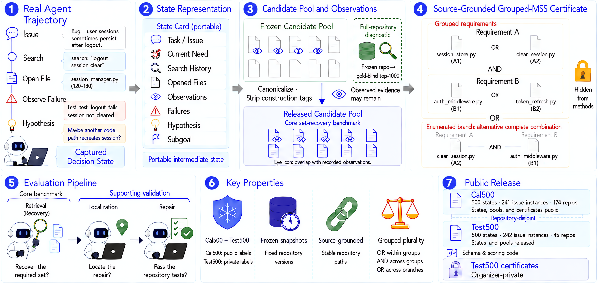

<div align="center">

# SERBench
### Find what the agent still needs—not just what looks relevant.

**State-conditioned minimal sufficient evidence recovery for coding agents**

**[Website](https://serbench.lordtarn1shed.chatgpt.site/) · [Evaluate your method](https://serbench.lordtarn1shed.chatgpt.site/#evaluate) · [Results & leaderboard](https://serbench.lordtarn1shed.chatgpt.site/#results)**

Browse the website without signing in. A GitHub account is needed only to submit a Test500 evaluation.

[Paper on arXiv](https://arxiv.org/abs/2609.20050) · [Quick start](#quick-start) · [Integrate your method](docs/QUICKSTART.md) · [Dataset](docs/DATASET.md) · [Evaluation](docs/EVALUATION.md) · [中文](README_zh.md)

**500 calibration states · 500 held-out states · Grouped sufficiency · Source-grounded evidence**

</div>



An agent can retrieve individually relevant passages and still miss a fact needed for its next decision. **SERBench evaluates whether the returned evidence set covers the decision's remaining requirements.** It provides captured agent states, candidate source excerpts, public calibration certificates, and a held-out test split with private certificates.

This repository is the **benchmark user interface**, not a copy of the paper's full experimental archive. Bring your own retriever or evidence-selection method; emit ranked evidence IDs; validate and evaluate them with the reference metrics.

## Quick start

Python 3.10 or newer. The core interface and starter baseline require no third-party runtime dependencies.

```bash
git clone https://github.com/LordTARN1SHED/SERBench.git
cd SERBench
python -m pip install -e .
python -m serbench inspect --split example
python -m serbench baseline --split example --output predictions.jsonl --k 8
python -m serbench score --split example --predictions predictions.jsonl --k 5 8 --output example_scores
```

The example uses three real calibration states. It checks your integration; it is **not** a benchmark result. The included BM25 starter is an onboarding baseline, not a reproduction of the paper's frozen BM25 experiment. Existing output files are protected against accidental overwriting.

### Evaluate your method

```python
from serbench import load_dataset

dataset = load_dataset("cal500")
state = dataset[0]
print(state["information_need"])
print(state["candidate_evidence"][0]["content_excerpt"])
```

Inference records do not contain certificates. Load them separately only for local development and scoring. See [the integration examples](examples/) and [the prediction contract](docs/EVALUATION.md).

```bash
python -m serbench baseline --split cal500 --output cal_predictions.jsonl --k 8
python -m serbench validate --split cal500 --predictions cal_predictions.jsonl
python -m serbench score --split cal500 --predictions cal_predictions.jsonl --k 5 8 --output cal_scores
```

For held-out evaluation, run on `test500`, validate your predictions, and [submit them to the private evaluation queue](docs/EVALUATION.md#held-out-test500-evaluation). Test labels are not distributed. The evaluation guide explains service activation and the author-assisted fallback.

## What is released?

| Split | States | Issue instances | Repositories | Certificates | Intended use |
|---|---:|---:|---:|---|---|
| Cal500 | 500 | 241 | 174 | Public | Development and calibration |
| Test500 | 500 | 242 | 45 | Organizer-private | Held-out evaluation |

The repository-disjoint splits include states before search, after search, after file inspection, and before editing. **Candidates may include already observed evidence.** The scoring target remains the support still missing from the captured state; the evaluation does not silently remove observed IDs from your ranking.

Start with [the data card](docs/DATASET.md) for construction scope, source-text limitations, certificate provenance, licensing, and appropriate use. Compressed JSONL is loaded directly by the SDK; no external model API is needed to inspect the dataset or run the starter.

## Reference result from the paper

| Method | Complete-MSS@5 | Complete-MSS@8 |
|---|---:|---:|
| Qwen3 embedding with reranking | 61.4% | 72.4% |
| MSS-Complement | **73.0%** | **80.6%** |

These are frozen Test500 paper results, not scores produced by the onboarding example. They describe the supplied-candidate set-recovery track; the paper separately studies recovery from frozen repository source. All twelve primary methods' five-metric summaries are available in [reference results](reference_results/). Successfully scored community submissions are published separately in [the automatic community results feed](community_results.json), with links to their evaluation records. The explicitly named service-integration-abstention entry is a zero-evidence service test, not a research baseline.

## Repository map

```text
data/             Compressed states/candidates, public calibration labels, provenance
src/serbench/     Loader, prediction validation, reference scoring, starter baseline
examples/         Custom-method integration
docs/             Data card, evaluation guide, paper
tests/            Interface and scoring checks
```

## Cite SERBench

If you use the data, task, or evaluation code, please cite:

```bibtex
@misc{feng2026missingcomplement,
  title = {The Missing Complement: State-Conditioned Minimal Sufficient Evidence for Coding Agents},
  author = {Feng, Zhexi and Zhang, Ruiyi and Yang, Yongbo and Xie, Pengtao},
  year = {2026},
  howpublished = {Preprint}
}
```

We will add the permanent preprint identifier when available. No conference acceptance is implied.

## License and contact

Original evaluation/interface code: [MIT](LICENSE). Original annotations and state-card material: [CC BY 4.0, subject to the scope described here](DATA_LICENSE.md). Upstream repository code, issue text, and other source excerpts retain their original rights and licenses; they are not relicensed as MIT or CC BY by this release.

Questions and bug reports: GitHub Issues. Private evaluation submissions: **zhf023@ucsd.edu**. Please do not post private certificates, credentials, or sensitive prediction metadata in public issues.
